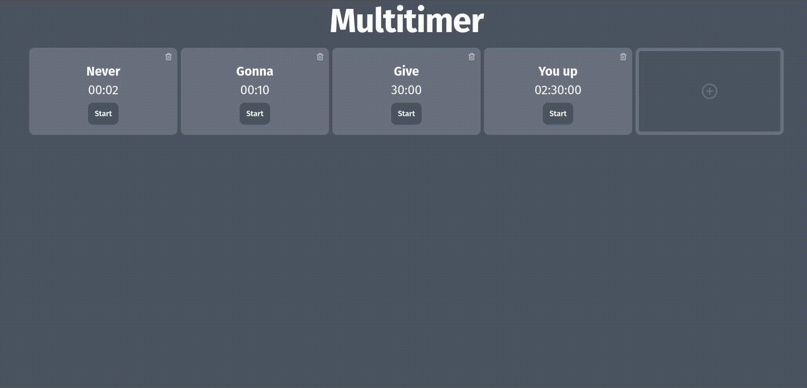

# Multitimer

A web app that allows you to handle multiple timers simultaneously. This idea came to mind when I was playing GTA Online and wanted a simple timer to monitor my business cooldowns easily without needing to pick up my phone (since windows 10's timer app sucks).

[Check it out](https://multitimer.brunomello.dev)

## Technologies used

- React with NextJS
- Tailwind

## Contributing

If you would like to contribute to the development of Multitimer, please feel free to open a pull request.

